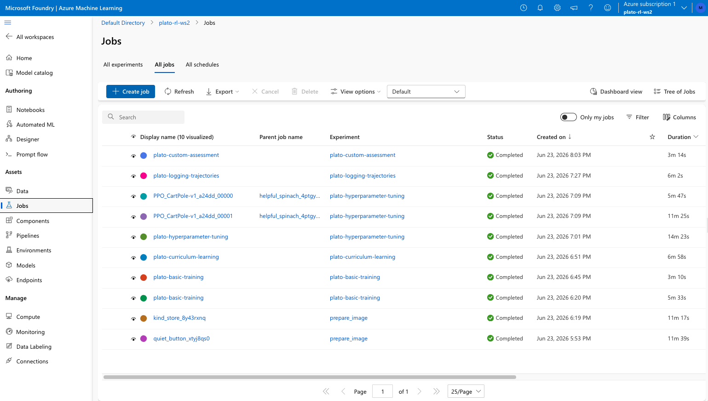
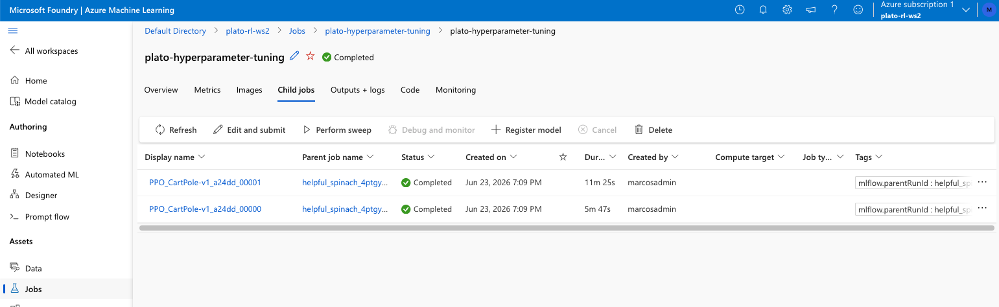
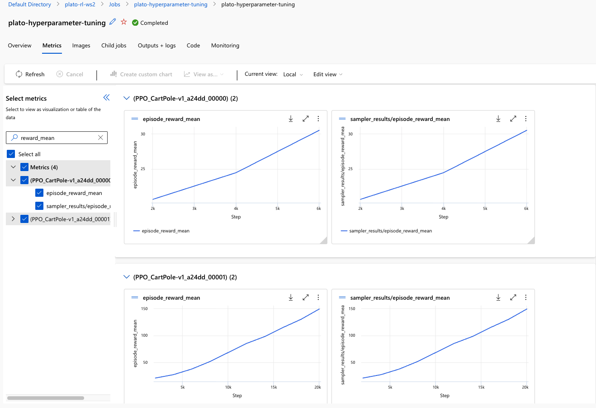
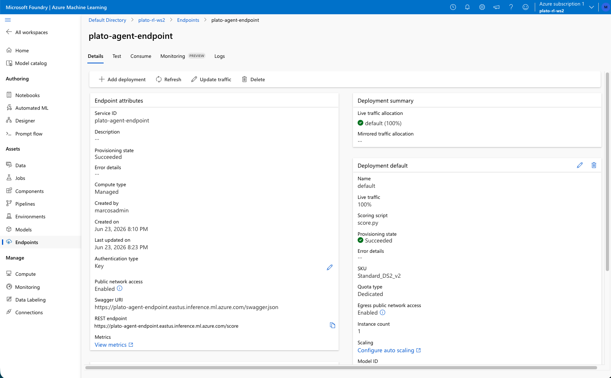
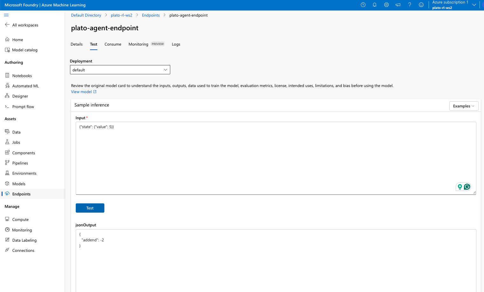
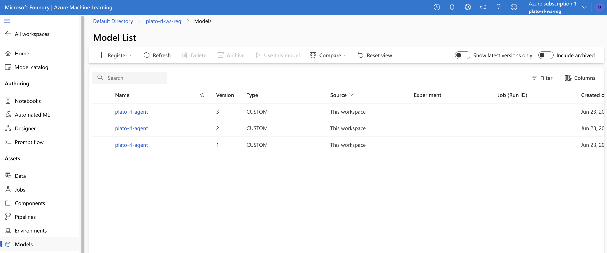
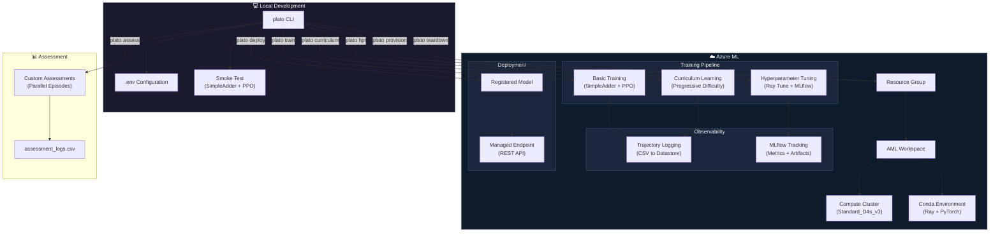

# Production Reinforcement Learning on Azure ML: PPO + Ray RLlib, End-to-End

**Train, tune, and deploy an RL agent to a managed Azure ML endpoint — from provisioning to teardown in a single CLI.**

[](https://www.python.org/downloads/release/python-3100/)
[](https://azure.microsoft.com/en-us/products/machine-learning)
[](https://docs.ray.io/en/latest/rllib/index.html)
[](LICENSE)

---

## Business Case

### The Problem

Organizations face a critical gap between prototyping RL solutions and deploying them at scale:

| Challenge | Impact |
|-----------|--------|
| **Computational bottleneck** | Training on a laptop takes weeks; complex policies never converge |
| **Infrastructure complexity** | 15+ manual Azure Portal steps to set up workspace, compute, environments |
| **Dependency hell** | Ray + Gymnasium + PyTorch version matrix causes days of debugging |
| **No observability** | Agents train as black boxes — impossible to understand behavior |
| **Cost risk** | Forgotten Azure resources silently accumulate surprise charges |

### The Solution

A **fully automated, single-command pipeline** that takes an RL simulation from local development to Azure-scale training to production deployment:

- **One `.env` file** replaces 15+ manual Azure Portal steps
- **Bulletproof dependencies** — exact pinned versions, pre-flight validation
- **Observability built-in** — trajectory logging is on by default
- **Idempotent operations** — re-run any step safely
- **Verified teardown** — ensures zero orphaned resources

### Results & Impact — Industry Benchmarks

RL at scale on cloud infrastructure delivers measurable business outcomes:

| Industry | Application | RL Method | Result | Source |
|----------|------------|-----------|--------|--------|
| **Energy / HVAC** | Building climate control | Deep RL controllers | **27–30% energy reduction** vs. rule-based, **39.6% cost savings** | Springer Nature, Cambridge University |
| **Supply Chain** | Inventory optimization | PPO policy | **9.1% cost reduction**, **46.7% emission reduction** | ASML / Informs M&SOM |
| **Financial Services** | Dynamic hedging | RL risk management | **18% credit risk reduction** during market stress | Industry case study |
| **Manufacturing** | Autonomous robotics | Hierarchical DRL | **45x faster training** than DeepMind baseline | Microsoft Project Bonsai |
| **Logistics** | Spare parts network | Deep Q-Learning | **Outperformed all existing heuristics** | ASML production deployment |
| **Retail** | Demand forecasting | Multi-agent RL | **15–25% inventory cost reduction** | McKinsey Global Institute |
| **Telecom** | Network optimization | PPO + multi-agent | **30% improvement** in resource allocation | Ericsson Research |

> **Scale advantage**: A single Ray RLlib training job parallelizes across hundreds of CPUs, compressing years of simulated experience into hours of compute time.

This project demonstrates the complete engineering workflow to bring RL from prototype to production — the skill set demanded by companies building autonomous systems, recommendation engines, and optimization platforms.

---

## Pipeline Results

### All Jobs — Full Pipeline Execution
> All 7 training experiments completed successfully on Azure ML, from basic training through hyperparameter tuning to custom assessment.



### Hyperparameter Tuning — MLflow Child Jobs
> ASHA scheduler managed 2 PPO trials on CartPole-v1, automatically pruning the underperformer early (5m vs 11m).



### MLflow Metrics — Training Reward Curves
> MLflow tracks `episode_reward_mean`, `episode_reward_max`, and `timesteps_total` per iteration — enabling visual comparison across tuning trials.



### Deployed Endpoint — Production Inference
> Trained agent deployed as an AML managed online endpoint with key-based authentication and auto-scaling.



### Live Inference Test — Endpoint Response
> The deployed agent receives an observation (`{"value": 5}`) and returns an action (`{"addend": ...}`) in real-time.



### Model Registry — Versioned Artifacts
> Trained model checkpoints registered in Azure ML for reproducibility and deployment tracking.



---

## Architecture



---

## Workflow Pipeline


| Step | Command | What It Does | Azure? | Duration |
|------|---------|-------------|--------|----------|
| 0 | `plato check` | Verify Python 3.10, Azure CLI, `az ml` extension | No | ~5s |
| 1 | `plato provision` | Create resource group, workspace, compute cluster | Yes | ~3 min |
| 2 | `plato setup-env` | Create AML conda environment from template | Yes | ~10–15 min |
| 3 | `plato smoke-test` | Local PPO training on SimpleAdder (5 iterations) | No | ~30s |
| 4 | `plato train` | Train PPO agent on SimpleAdder with trajectory logging | Yes | ~10 min |
| 5 | `plato curriculum` | Train with progressive difficulty (curriculum learning) | Yes | ~15 min |
| 6 | `plato hpt` | Hyperparameter tuning with Ray Tune + MLflow | Yes | ~30 min |
| 7 | `plato trajectories` | Dedicated trajectory logging on CartPole-v1 | Yes | ~10 min |
| 8 | `plato assess` | Evaluate trained agent on custom configurations | Yes | ~10 min |
| 9 | `plato deploy` | Deploy to AML managed REST endpoint | Yes | ~10 min |
| 10 | `plato teardown` | Delete ALL resources + verify cleanup | Yes | ~5 min |

---

## Reinforcement Learning Primer

If you're new to RL, here's what each concept means in the context of this project:

```
┌─────────────────────────────────────────────────────┐
│                    ENVIRONMENT                      │
│              (SimpleAdder Simulation)               │
│                                                     │
│   State: current value (e.g., 23)                   │
│   Goal:  reach value = 50                           │
│                                                     │
│         ┌──────────┐    action      ┌──────────┐    │
│         │          │──(addend=+5)──▶│          │    │
│         │  AGENT   │                │   SIM    │    │
│         │  (PPO)   │◀──(reward,──--─│  (Adder) │    │
│         │          │   new state)   │          │    │
│         └──────────┘                └──────────┘    │
└─────────────────────────────────────────────────────┘
```

| Concept | In This Project |
|---------|----------------|
| **Agent** | Neural network trained with PPO (Proximal Policy Optimization) |
| **Environment** | SimpleAdder — a number starts random, agent adds/subtracts to reach 50 |
| **State** | Current value (observation the agent sees) |
| **Action** | Integer in [-10, 10] to add to the value |
| **Reward** | Negative distance to 50 (closer = higher reward) |
| **Episode** | One attempt to reach 50, max 10 steps |
| **Policy** | The learned strategy mapping states to actions |
| **Curriculum** | Gradually harder starting positions (closer → farther from 50) |

---

## Quick Start

```bash
# 1. Clone and setup
git clone https://github.com/your-username/plato-rl-azure.git
cd plato-rl-azure
make setup

# 2. Configure Azure (edit .env with your subscription ID)
cp .env.example .env
# Edit .env → set AZURE_SUBSCRIPTION_ID

# 3. Activate and verify
source .venv/bin/activate
plato check

# 4. Run local smoke test (no Azure needed)
plato smoke-test

# 5. Run full Azure pipeline
plato provision      # Create Azure resources
plato train          # Train on Azure ML
plato teardown       # Clean up when done
```

---

## Prerequisites

| Requirement | Version | How to Install |
|-------------|---------|----------------|
| **Python** | 3.10.x (required) | `brew install python@3.10` or [python.org](https://www.python.org/downloads/) |
| **Azure CLI** | Latest | `brew install azure-cli` or [docs](https://learn.microsoft.com/en-us/cli/azure/install-azure-cli-macos) |
| **Azure ML extension** | Latest | `az extension add -n ml` (auto-installed by `plato check`) |
| **Azure subscription** | Active | [Free trial](https://azure.microsoft.com/en-us/free/) |

**No Docker required.** The entire deployment is via Azure ML managed endpoints.

---

## Step-by-Step Guide

### Step 0: Check Prerequisites
```bash
plato check
```
Verifies Python version, Azure CLI installation, `az ml` extension, and `.env` configuration. Automatically installs the ML extension if missing.

### Step 1: Provision Azure Resources
```bash
plato provision
```
Creates (idempotent — safe to re-run):
- **Resource Group** (`plato-rl-rg`) — container for all resources
- **AML Workspace** (`plato-rl-ws`) — experiment management hub
- **Compute Cluster** (`plato-compute`) — Standard_D4s_v3, scales 0-2 nodes
- **Conda Environment** (`plato-rl-env`) — Ray 2.5.0, PyTorch, Gymnasium

### Step 3: Local Smoke Test
```bash
plato smoke-test
```
Trains a PPO agent on SimpleAdder locally for 5 iterations (~30 seconds). Validates the entire RL stack works before spending money on Azure.

### Steps 4-8: Azure ML Training Pipeline
```bash
plato train          # Basic PPO training with trajectory logging
plato curriculum     # Curriculum learning (progressive difficulty)
plato hpt            # Hyperparameter tuning with MLflow
plato trajectories   # Dedicated trajectory logging
plato assess         # Custom assessment on trained agent
```

Each step submits a job to Azure ML, polls until completion, and downloads outputs.

### Step 9: Deploy Agent
```bash
plato deploy --checkpoint ./outputs/basic
```
Registers the trained model, creates an AML-managed endpoint, deploys, and tests:
```bash
curl --request POST \
  --header "Authorization: Bearer $TOKEN" \
  --header "Content-Type: application/json" \
  --url "$ENDPOINT_URL" \
  --data '{"state": {"value": 5}}'
```

### Step 10: Teardown
```bash
plato teardown
```
1. Lists all resources in the resource group
2. Shows the inventory table
3. Asks for confirmation (type resource group name)
4. Deletes the entire resource group
5. Verifies deletion completed
6. Checks for orphaned tagged resources
7. Reports: "All resources deleted. Zero charges."

Use `--force` to skip confirmation: `plato teardown --force`

---

## Monitoring Experiments with MLflow

The HPT step (`plato hpt`) integrates with **MLflow** for experiment tracking, metric logging, and checkpoint management. MLflow captures hyperparameter configs, training curves, and model artifacts for every trial — enabling you to compare runs and identify the best-performing configuration.

### How It Works

The HPT script uses Ray Tune's `MLflowLoggerCallback` to log results to MLflow automatically:

```python
from ray.air.integrations.mlflow import MLflowLoggerCallback
from mlflow.utils.mlflow_tags import MLFLOW_PARENT_RUN_ID

run_config = air.RunConfig(
    callbacks=[
        MLflowLoggerCallback(
            tags={MLFLOW_PARENT_RUN_ID: current_run.info.run_id},
            experiment_name="plato_hpt_ppo",
            save_artifact=True,
        )
    ],
)
```

The `MLFLOW_PARENT_RUN_ID` tag groups all tuning trials under a single parent job, making it easy to view and compare them in Azure ML Studio.

### What Gets Logged

Each trial logs:
- **Metrics**: `episode_reward_mean`, `episode_reward_max`, `timesteps_total`, `training_iteration`, etc.
- **Parameters**: `clip_param`, `lr`, `lambda`, `num_sgd_iter`, `kl_coeff`
- **Artifacts**: Model checkpoints, `progress.csv`, `result.json`

### Viewing Results in Azure ML Studio

1. Navigate to [ml.azure.com](https://ml.azure.com) → select your workspace
2. Click **Jobs** in the left sidebar
3. Find the `plato-hyperparameter-tuning` experiment
4. Click **Include child jobs** to see individual tuning trials
5. Use filters to find top performers:
   - Sort by `episode_reward_mean` (highest) to find the best models
   - Filter by `training_iteration` to see the most-trained agents
   - Filter by job status to find completed runs

### Custom Charts

In Azure ML Studio, you can create custom comparison charts:
1. Open your experiment → **Charts** tab
2. Click **New Chart**
3. Select `episode_reward_mean` as the metric
4. Save as default for quick access

### Downloading Best Checkpoint

After HPT completes, the best checkpoint is available in the job outputs. You can also use MLflow's Python API to find the top-performing run:

```python
import mlflow
experiments = mlflow.search_experiments()
best_run = mlflow.search_runs(
    experiment_names=["plato_hpt_ppo"],
    order_by=["metrics.episode_reward_mean DESC"],
    max_results=1,
)
print(f"Best run: {best_run.iloc[0]['run_id']}")
```

---

## Configuration Reference

All settings are in `.env` (copy from `.env.example`):

| Variable | Default | Description |
|----------|---------|-------------|
| `AZURE_SUBSCRIPTION_ID` | (required) | Your Azure subscription ID |
| `AZURE_RESOURCE_GROUP` | `plato-rl-rg` | Resource group name |
| `AZURE_LOCATION` | `eastus` | Azure region |
| `AZURE_WORKSPACE_NAME` | `plato-rl-ws` | AML workspace name |
| `AZURE_COMPUTE_NAME` | `plato-compute` | Compute cluster name |
| `AZURE_COMPUTE_VM_SIZE` | `Standard_D4s_v3` | VM size (4 CPU, 16GB) |
| `AZURE_COMPUTE_MIN_NODES` | `0` | Min nodes (0 = deallocate when idle) |
| `AZURE_COMPUTE_MAX_NODES` | `2` | Max nodes for scaling |
| `TRAINING_ITERATIONS` | `10` | PPO training iterations |
| `NUM_TUNE_SAMPLES` | `10` | Hyperparameter search samples |

---

## Project Structure

```
plato-rl-azure/
├── src/plato_rl/           # Main Python package
│   ├── cli.py              # Click CLI with all 11 step commands
│   ├── config.py           # .env configuration loading
│   ├── console.py          # Rich terminal output helpers
│   ├── azure/              # Azure CLI orchestration
│   │   ├── auth.py         # Login and subscription management
│   │   ├── provision.py    # Idempotent resource creation
│   │   ├── jobs.py         # Job submission, polling, downloads
│   │   ├── teardown.py     # Resource deletion with verification
│   │   └── cli_runner.py   # az CLI subprocess wrapper with retry
│   ├── training/           # Training step implementations
│   ├── observability/      # Trajectory and curriculum callbacks
│   ├── assessment/         # Custom episode evaluation
│   ├── deploy/             # AML endpoint deployment
│   ├── sims/               # Gymnasium simulation environments
│   ├── platotk/            # Vendored RL utilities (serialize, restore)
│   └── templates/          # Jinja2 templates for AML YAML files
├── aml_src/                # Source code uploaded to Azure ML compute
├── tests/                  # Unit tests (mocked Azure, real RL)
├── Makefile                # Common operations
├── .env.example            # Configuration template
└── README.md               # This file
```

---

## Troubleshooting

### Local Environment Issues

| Problem | Solution |
|---------|----------|
| `Python version mismatch` | Install Python 3.10: `brew install python@3.10`. Ray 2.5.0 requires 3.10 — it has no binary wheels for 3.11+ and won't work on 3.13. |
| `grpcio build fails` | Ray 2.5.0 on macOS requires `grpcio<=1.49.1`. We pin `grpcio==1.47.5` which has a prebuilt wheel. If pip tries to build from source, run: `pip install --only-binary=:all: grpcio==1.47.5` |
| `ModuleNotFoundError: pkg_resources` | Use `pip<25` and `setuptools<75` when creating the venv: `pip install "pip<25" "setuptools<75" wheel` |
| `Ray import errors` | Ensure you're using the project venv: `source .venv/bin/activate` |
| `Ray deprecation warnings` | Warnings about `UnifiedLogger`, `np.bool8` are cosmetic — Ray 2.5.0 internal warnings, safe to ignore |
| `venv creation fails` | Use the conda plato env Python: `/opt/anaconda3/envs/plato/bin/python3 -m venv .venv` |

### Azure CLI & Authentication

| Problem | Solution |
|---------|----------|
| `az: command not found` | Install Azure CLI: `brew install azure-cli` |
| `ML extension not found` | Run: `az extension add -n ml --yes` (auto-installed by `plato check`) |
| `Not logged in to Azure` | Run: `az login` or `az login --use-device-code` for headless environments |
| `AuthorizationFailed during polling` | Azure CLI token expired. Re-run `az login`. Long-running jobs (10+ min) may outlast the token. The job continues on Azure regardless — only local polling is affected. |

### Azure ML Workspace & Provisioning

| Problem | Solution |
|---------|----------|
| `Soft-deleted workspace exists` | Azure keeps deleted workspaces in soft-delete for 14 days. The `forcePurge` REST API is unreliable. **Fix:** change `AZURE_WORKSPACE_NAME` in `.env` to a new name (e.g., `plato-rl-ws2`). The provision script attempts to purge automatically, but may not succeed. |
| `Compute nodes not starting` | With min_nodes=0, first job waits 5-10 min for scale-up. This is normal. |
| `MPI multi-node jobs fail silently` | Jobs with `instance_count: 2` may fail at "Starting" with no logs when the cluster can't provision both nodes simultaneously. **Fix:** use `instance_count: 1` for Ray Tune jobs — Tune parallelizes trials on a single node via multiple CPUs. |

### AML Environment & Dependencies

| Problem | Solution |
|---------|----------|
| `AML environment build slow` | First build takes 10-15 min (conda resolution on Azure). Subsequent runs use the cached Docker image. |
| `Image build failed` | AML environment Docker build failed. Check `azureml-logs/20_image_build_log.txt`. Common cause: unpinned pip packages pulling incompatible versions. We pin numpy/pandas as conda deps (not pip) to avoid source builds. |
| `numpy _Py_HashDouble error` | numpy source compilation fails on newer gcc. **Fix:** install numpy via conda (not pip) — conda provides prebuilt binaries. Already handled in our conda.yml template. |
| `No module named pkg_resources` | Ray 2.5.0 imports `pkg_resources` which was removed in `setuptools>=70`. **Fix:** pin `setuptools<70` in both conda and pip sections of conda.yml. Already handled in our template. |
| `Ray CLI deepcopy/Sentinel crash` | Ray 2.5.0 is incompatible with `click>=8.2`. **Fix:** pin `click<8.2` in conda.yml. Already handled in our template. |

### Training Job Failures

| Problem | Solution |
|---------|----------|
| `ModuleNotFoundError: tensorflow_probability` | Ray 2.5.0's `_register_all()` imports the Bandit algorithm which requires TensorFlow. Triggered by `tune.Tuner("PPO")` with a string name. **Fix:** pass the `PPO` class directly instead of the string `"PPO"`: `from ray.rllib.algorithms.ppo import PPO; tune.Tuner(PPO, ...)` |
| `protobuf Descriptors error` | `tensorboardX==2.2` uses old-style protobuf descriptors incompatible with newer `protobuf` versions installed by Azure. **Fix:** set env var `PROTOCOL_BUFFERS_PYTHON_IMPLEMENTATION=python` in the job YAML `environment_variables` section. |
| `No module named mlflow.utils.async_logging` | The `azureml-mlflow` package requires `mlflow>=2.8.0` for the `async_logging` module. **Fix:** use `mlflow==2.9.2` (not 2.4.1) in conda.yml. Already handled in our template. |
| `MLflow Workspace not found` | Older `azureml-mlflow` versions (e.g., 1.51.0) can't connect to newer AML workspaces. **Fix:** leave `azureml-mlflow` unpinned and use `mlflow>=2.9.0`. Already handled in our template. |
| `Job timeout` | Increase timeout in config or check Azure ML Studio for errors. |

### Deployment Issues

| Problem | Solution |
|---------|----------|
| `ModuleNotFoundError: platotk` in scoring script | The vendored `platotk` package must be included in the deployment source directory alongside `score.py`. Already handled — `aml_src/deploy/` contains both `score.py` and the `platotk/` package. |
| `No valid deployments to route to` | Endpoint exists but has no traffic allocation. **Fix:** run `az ml online-endpoint update --name <endpoint> --traffic "default=100"`. Already handled in our deploy script. |
| `Score script import errors` | The scoring script runs in isolation on AML's inference server. All imports must be available in the AML environment or bundled with the code directory. |

---

## Testing

```bash
# Run all unit tests
make test

# Run with coverage
pytest tests/ -v --cov=plato_rl --tb=short

# Run linting
make lint
```

---

## Learning Resources

- [Ray RLlib Documentation](https://docs.ray.io/en/latest/rllib/index.html) — Industry-grade RL library
- [Gymnasium Docs](https://gymnasium.farama.org/) — Standard RL environment API
- [Azure ML Documentation](https://learn.microsoft.com/en-us/azure/machine-learning/) — Cloud ML platform
- [PPO Paper](https://arxiv.org/abs/1707.06347) — The algorithm used in this project
- [Curriculum Learning Survey](https://arxiv.org/abs/2003.04960) — Progressive training strategies
- [Spinning Up in Deep RL](https://spinningup.openai.com/) — OpenAI's RL educational resource

---

## License

MIT License. Based on [Azure/plato](https://github.com/Azure/plato) by Microsoft.
